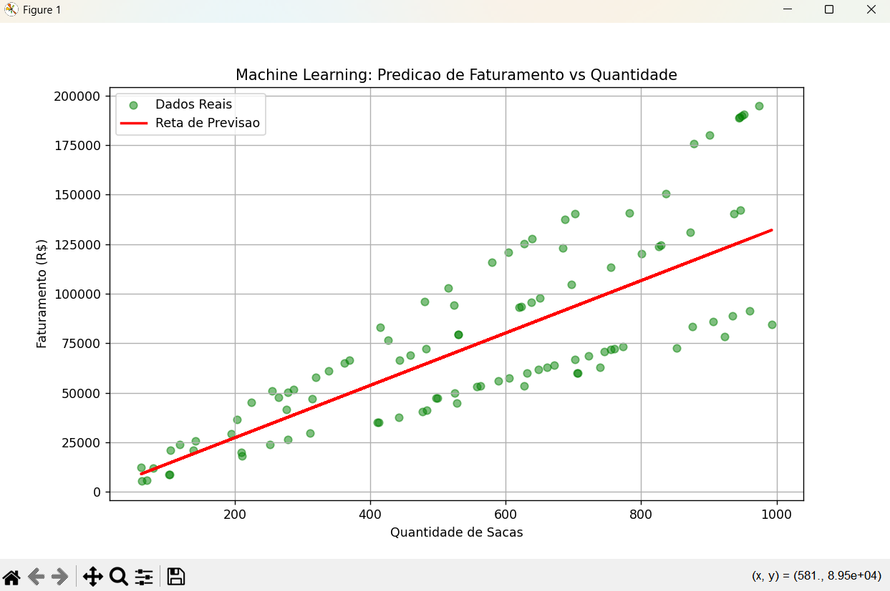

# 🌾 Dashboard de Performance Comercial - Safra 2024

Este repositório contém um dashboard interativo desenvolvido no **Power BI** para análise de indicadores de vendas no agronegócio, integrado a um modelo preditivo desenvolvido em **Python** para estimativa de faturamento.

---

## 🖼️ Visualização do Projeto

### Visão Geral do Dashboard

> [!TIP]
> **[📄 Clique aqui para abrir o Relatório em PDF (Visualização Rápida)](docs/Relatorio_Performance_Agro.pdf)**

### Inteligência Preditiva (Python)

*Reta de regressão mostrando a correlação entre quantidade de sacas e faturamento estimado.*

### Detalhes e Filtros do Dashboard

  
  
  
  

---

## 🚀 Objetivo do Projeto

Transformar dados brutos de vendas em insights estratégicos. O projeto une a clareza visual do Business Intelligence com o poder estatístico do Machine Learning para identificar produtos rentáveis e prever resultados financeiros.

## 🛠️ Tecnologias e Ferramentas

* **Power BI Desktop**: Dashboard e visualizações interativas.
* **Python (Pandas & Scikit-learn)**: Engenharia de dados e modelagem preditiva.
* **Linguagem DAX**: Criação de medidas complexas de faturamento.
* **Excel**: Armazenamento das tabelas Fato e Dimensões.

## 📊 Principais Funcionalidades

* **KPIs Dinâmicos**: Acompanhamento em tempo real de faturamento e volume.
* **Análise de Sazonalidade**: Identificação de picos de venda durante a safra.
* **Segmentação Regional**: Filtros avançados por Estados e Categorias.

## 🤖 Módulo de Machine Learning (Predictive Analytics)

Utilizei a biblioteca **Scikit-learn** para treinar um modelo de Regressão Linear que estima o faturamento com base no volume de vendas (sacas):
* **Métrica R² (Precisão):** 0.60
* **Erro Médio Absoluto:** R$ 29.294,11
* **Lógica aplicada:** O script realiza o merge entre as tabelas `fVendas` e `dProdutos` para calcular o faturamento real antes de treinar o modelo.

## 📁 Estrutura do Repositório

* **/data**: Base de dados `Dados_Dashboard_Agro.xlsx`.
* **/docs**: Relatório `Relatorio_Performance_Agro.pdf`.
* **/notebooks**: Script `previsao_faturamento.py`.
* **/screenshots**: Capturas de tela e gráfico do modelo.
* **Dashboard_Performance_Agro_2024.pbix**: Arquivo fonte do Power BI.

## 📥 Como visualizar

1.  Clone o repositório ou baixe os arquivos.
2.  Abra o arquivo `.pbix` no Power BI Desktop.
3.  Para rodar a previsão, execute o script em `/notebooks` (requer Python 3.11+ e bibliotecas pandas/scikit-learn).

---
**Desenvolvido por Vítor Hugo Sátiro** 🚀